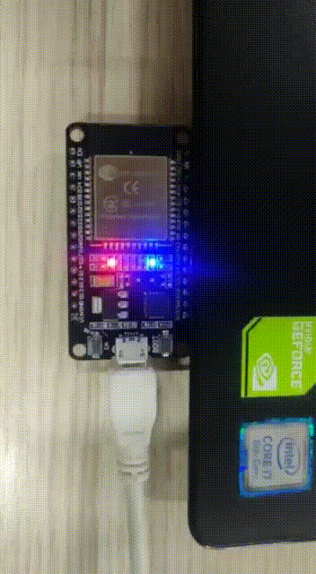
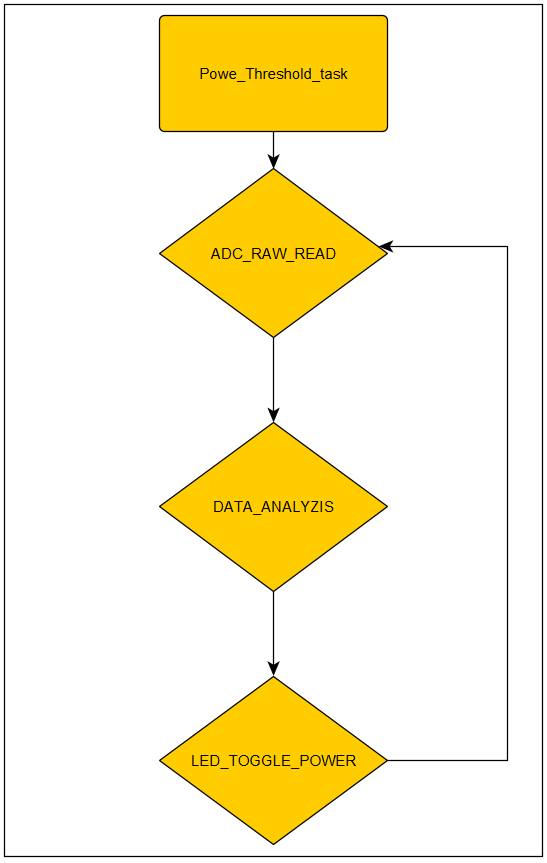

# RTOS UNAL

Repository with all activities made during RTOS subject.

Microcontroller used: ESP-WROOM-32
ESP IDF version: 4.4.4


## Students: 

* Jhon Alejandro Sanchez Sanabria C.C: 1053873573
* Edwin Andres Fiesco Cod: 817019


# Final Project

## Explanation

The backbone of our system is an HTML server that provides real-time data visualization. This server not only acts as a display for the measurements but also provides an interface for setting the threshold for power values. An interesting feature we developed is a LED indicator that activates when these power values exceed the user-set threshold. This was done to add a tangible, visual component to the project and demonstrate a practical application of threshold-based alert systems.

Understanding the need for system updates and flexibility, we incorporated Over-the-Air (OTA) update functionality. This allows the firmware to be updated wirelessly, aligning with modern technological trends and minimizing physical intervention.

Another highlight is the inclusion of an RGB LED that users can toggle using specific RGB values. This feature allows for customization of the LED's color and brightness, giving users control over the visual aspect of the system.

Through this project, we sought to bridge theory and practical application, developing our understanding of RTOS.

## Components:

* ESP32-WROOM 



* ZMPT101B


* TA12-100


* 10K Thermistor


## Hardware Montage


## HTTP Page


## Code Workflow

### Main.c:


### Power:



### wifi app:


### http server:


## Code features:

### [main.c](Final_Project/FINAL_RTOS_HTTP/main/main.c) file contains the following core functions:
* ADC_ger_raw: this function takes the Raw data from the ADC, takes 16 samples every 16 ms for 1 second to make sure we are taking the data from the positive part of the AC wave.

```c
static void ADC_get_raw()
{
    int  volt_raw_adc_ch7 = 0, amp_raw_adc_ch0 = 0;


    /*Number of samples take in order to take the positive AC SEN*/

    int Samples = 16;
    while ( Samples > 1)
    {
        int volt_adc = adc1_get_raw(ADC1_CHANNEL_7);
        if( volt_adc > volt_raw_adc_ch7){
        volt_raw_adc_ch7 = volt_adc;
        }
        int amp_adc = adc1_get_raw(ADC1_CHANNEL_0);
        if( amp_adc > amp_raw_adc_ch0){
            amp_raw_adc_ch0 = amp_adc;
        }
        Samples--;
        vTaskDelay(1);
    }

    
    //printf("Sensor temp: %d\n\r", temp_raw_adc_ch6);
    float volt_real_adc_ch7 = ((((volt_raw_adc_ch7 - 2000.00)/400.00)*85.00)*2.00)/1.4142;
    float amp_real_adc_ch0 = (((amp_raw_adc_ch0/1692.00)*1.30)*2.00)/1.4142;

    float temp_raw_adc_ch6_temp = 0;
    float temp_raw_adc_ch6 = 0;


    /*Number of samples in order to make the temp data better*/

    for(int i=0;i<=9; i++){
        temp_raw_adc_ch6_temp = adc1_get_raw(ADC1_CHANNEL_6);
        temp_raw_adc_ch6 +=temp_raw_adc_ch6_temp;
        vTaskDelay(pdMS_TO_TICKS(1));
    }


    temp_raw_adc_ch6 = temp_raw_adc_ch6/10;
    temp_raw_adc_ch6 = (temp_raw_adc_ch6*3.3)/4096;
    temp_raw_adc_ch6 = (10000*temp_raw_adc_ch6)/(3.3-temp_raw_adc_ch6);

    float temperatura_temporal = 1/298.15+log(temp_raw_adc_ch6/10000)/3977;
    temperatura_temporal = 1/temperatura_temporal-273.15;


    printf("Sensor temp: %f\n\r", temperatura_temporal);

    printf("Sensor volt: %f\n\r", volt_real_adc_ch7);

    printf("Sensor amp: %f\n\r", amp_real_adc_ch0);


    temperatura = temperatura_temporal;
    voltage = volt_real_adc_ch7;
    current = amp_real_adc_ch0;
    power = voltage * current;

    printf("Power: %f\n\r", power);

}
```
*   Power Threshold Task: this simple function set the gpio status of the RGB led according to the Power measure made in the function above, this funtion is on an infinite loop in order to update the measurement on the HTTP server.

```c
    static void power_task(void *pvParameters)
    {
        /* Each sec read Power value*/
        while (1)
        {
            ADC_get_raw();

            if ((power>=red_min) && (power<=red_max)){
                gpio_set_level(power_red,1);
            }else{
                gpio_set_level(power_red,0);
            }
            if ((power>=green_min) && (power<=green_max)){
                gpio_set_level(power_green,1);
            }else{
                gpio_set_level(power_green,0);
            }
            if ((power>=blue_min) && (power<=blue_max)){
                gpio_set_level(power_blue,1);
            }else{
                gpio_set_level(power_blue,0);
            }

            vTaskDelay(pdMS_TO_TICKS(1000));
        }
    }
```

### [wifi_app.c](Final_Project/FINAL_RTOS_HTTP/main/wifi_app.c) file contains the following core functions:


* WIFI app task: this task is the main task of the WIFI app, it start the event handler of the ESP wifi, make the initial wifi configurationl like IP, SSID name, password, ect and use a RTOS queue in order to start the http server.
```c
static void wifi_app_task(void *pvParameters)
{
    wifi_app_queue_message_t msg;

    // Initialize the event handler
    wifi_app_event_handler_init();

    // Initialize the TCP/IP stack and WiFi config
    wifi_app_default_wifi_init();

    // SoftAP config
    wifi_app_soft_ap_config();

    // Start WiFi
    ESP_ERROR_CHECK(esp_wifi_start());

    // Send first event message
    wifi_app_send_message(WIFI_APP_MSG_START_HTTP_SERVER);

    for (;;)
    {
        if (xQueueReceive(wifi_app_queue_handle, &msg, portMAX_DELAY))
        {
            switch (msg.msgID)
            {
                case WIFI_APP_MSG_START_HTTP_SERVER:
                    ESP_LOGI(TAG, "WIFI_APP_MSG_START_HTTP_SERVER");

                    http_server_start();
                    //rgb_led_http_server_started();

                    break;

                case WIFI_APP_MSG_CONNECTING_FROM_HTTP_SERVER:
                    ESP_LOGI(TAG, "WIFI_APP_MSG_CONNECTING_FROM_HTTP_SERVER");

                    break;

                case WIFI_APP_MSG_STA_CONNECTED_GOT_IP:
                    ESP_LOGI(TAG, "WIFI_APP_MSG_STA_CONNECTED_GOT_IP");
                    //rgb_led_wifi_connected();

                    break;

                default:
                    break;

            }
        }
    }
}
```
* Wi-Fi app Start: this function makes the configuration of the RTOS task of the Wi-Fi app, the Wi-Fi app has the higher priority since it starts the AP that we are going to connect and runs the http server.

```c
void wifi_app_start(void)
{
    ESP_LOGI(TAG, "STARTING WIFI APPLICATION");

    // Start WiFi started LED
    // rgb_led_wifi_app_started();

    // Disable default WiFi logging messages
    esp_log_level_set("wifi", ESP_LOG_NONE);

    // Create message queue
    wifi_app_queue_handle = xQueueCreate(3, sizeof(wifi_app_queue_message_t));

    // Start the WiFi application task
    xTaskCreatePinnedToCore(&wifi_app_task, "wifi_app_task", WIFI_APP_TASK_STACK_SIZE, NULL, WIFI_APP_TASK_PRIORITY, NULL, WIFI_APP_TASK_CORE_ID);
}
```

### [http_server.c](Final_Project/FINAL_RTOS_HTTP/main/http_server.c) file contains the following core functions:


* http_server_blue_threshold_handler: This simple code recieve the JSON sent by the HTTP server with the threshold min/max values that are going to be changed at the main.c file. there are 2 more funtions that makes the same thing but changing the red and green threshold. Explain is not neccesary.
```c
static esp_err_t http_server_blue_threshold_handler(httpd_req_t *req){

	size_t len_val_min = 0, len_val_max = 0;
	char *min_str = NULL,  *max_str = NULL;

	len_val_min = httpd_req_get_hdr_value_len(req, "min_val") + 1;
	len_val_max = httpd_req_get_hdr_value_len(req, "max_val") + 1;
	if (len_val_min > 1)
	{
		min_str = malloc(len_val_min);
		if (httpd_req_get_hdr_value_str(req, "min_val", min_str, len_val_min) == ESP_OK)
		{
			ESP_LOGI(TAG, "blue min value received: %s", min_str);
		}
	}

	if (len_val_max > 1)
	{
		max_str = malloc(len_val_max);
		if (httpd_req_get_hdr_value_str(req, "max_val", max_str, len_val_max) == ESP_OK)
		{
			ESP_LOGI(TAG, "blue max value received: %s", max_str);
		}
	}

	if (atof(min_str) <= atof(max_str)){
		blue_min = atof(min_str);
		blue_max = atof(max_str);
	}

	httpd_resp_set_hdr(req, "Connection", "close");
    httpd_resp_send(req, NULL, 0);
	
	return ESP_OK;
}
```

* http_server_rgb_values_handler: this function takes the JSON that the HTTP server sends, takes the RGB values from 0 to 255 then use the atoi function in order to make this values readable for the ESP and finally replace this RGB values in the rgb_led_set_color function.

```c
static esp_err_t http_server_rgb_values_handler(httpd_req_t *req)
{
	ESP_LOGI(TAG, "/rgb_values.json requested");

	size_t len_red_val = 0, len_green_val = 0, len_blue_val = 0;
	char *red_str = NULL,  *green_str = NULL, *blue_str = NULL;


	// Get red header
	len_red_val = httpd_req_get_hdr_value_len(req, "red_val") + 1;
	if (len_red_val > 1)
	{
		red_str = malloc(len_red_val);
		if (httpd_req_get_hdr_value_str(req, "red_val", red_str, len_red_val) == ESP_OK)
		{
			ESP_LOGI(TAG, "red value received: %s", red_str);
		}
	}
	// Get green header
	len_green_val = httpd_req_get_hdr_value_len(req, "green_val") + 1;
	if (len_green_val > 1)
	{
		green_str = malloc(len_green_val);
		if (httpd_req_get_hdr_value_str(req, "green_val", green_str, len_green_val) == ESP_OK)
		{
			ESP_LOGI(TAG, "green value received: %s", green_str);
		}
	}
	// Get blue header
	len_blue_val = httpd_req_get_hdr_value_len(req, "blue_val") + 1;
	if (len_blue_val > 1)
	{
		blue_str = malloc(len_blue_val);
		if (httpd_req_get_hdr_value_str(req, "blue_val", blue_str, len_blue_val) == ESP_OK)
		{
			ESP_LOGI(TAG, "blue value received: %s", blue_str);
		}
	}
	// Cerrar la conexion
    httpd_resp_set_hdr(req, "Connection", "close");
    httpd_resp_send(req, NULL, 0);
    
	rgb_led_set_color(atoi(red_str), atoi(green_str), atoi(blue_str));
	return ESP_OK;
}
```

* http_server_get_dht_sensor_readings_json_handler: this funtion takes the values of the temperature, voltage, current and power in order to make the JSON that is going to be send, the JSON is made using the sprintf funtion.
```c
static esp_err_t http_server_get_dht_sensor_readings_json_handler(httpd_req_t *req)
{
	ESP_LOGI(TAG, "/dhtSensor.json requested");

	char dhtSensorJSON[200];

	sprintf(dhtSensorJSON, "{\"temp\":\"%.1f\",\"volt\":\"%.1f\",\"current\":\"%.1f\",\"power\":\"%.1f\"}", temperatura, voltage, current, power);

	httpd_resp_set_type(req, "application/json");
	httpd_resp_send(req, dhtSensorJSON, strlen(dhtSensorJSON));

	return ESP_OK;
}
```
### [rgb_led.c](Final_Project/FINAL_RTOS_HTTP/main/rgb_led.c) file contains the following core functions:

* rgb_led_set_color: Making use of the LEDc driver and PWM, this simple function changes the RGB color that is going to be changed via HTTP server, only accepting values between 0 and 255.

```c

void rgb_led_set_color(uint8_t red, uint8_t green, uint8_t blue)
{
	// Value should be 0 - 255 for 8 bit number
	ledc_set_duty(ledc_ch[0].mode, ledc_ch[0].channel, red);
	ledc_update_duty(ledc_ch[0].mode, ledc_ch[0].channel);

	ledc_set_duty(ledc_ch[1].mode, ledc_ch[1].channel, green);
	ledc_update_duty(ledc_ch[1].mode, ledc_ch[1].channel);

	ledc_set_duty(ledc_ch[2].mode, ledc_ch[2].channel, blue);
	ledc_update_duty(ledc_ch[2].mode, ledc_ch[2].channel);
}
```

###  The following funtions was added to the [app.js](Final_Project/FINAL_RTOS_HTTP/main/webpage/app.js) file:

* send_rgb_values: this funtion takes the values put on the boxes and makes the JSON that the ESP is going to use to change the RGB LED values
```js
function send_rgb_values()
{
	
	red_val = $("#red_val").val();
	green_val = $("#green_val").val();
	blue_val = $("#blue_val").val();
	
	
	$.ajax({
		url: '/rgb_vals.json',
		dataType: 'json',
		method: 'POST',
		cache: false,
		headers: {'red_val': red_val, 'green_val': green_val, 'blue_val': blue_val},
		data: {'timestamp': Date.now()}
	});
}
```
* getDHTSensorValues: this funtion get the JSON made by the ESP in order to display the values of the temperature, voltage, current and power.

```js
function getDHTSensorValues()
{
	$.getJSON('/dhtSensor.json', function(data) {
		$("#temperature_reading").text(data["temp"]);
		$("#voltage_reading").text(data["volt"]);
		$("#current_reading").text(data["current"]);
		$("#power_reading").text(data["power"]);
	});
}
```
* send_red_values: this funtion makes the JSON that the ESP is going to use to change the Threshold of the RGB led, there are 2 more funtions that are doing the same thing but with the Blue and green Threshold.

```js
function send_red_values()
{
	min_val = $("#min_val").val();
	max_val = $("#max_val").val();
	
	$.ajax({
		url: '/red_vals.json',
		dataType: 'json',
		method: 'POST',
		cache: false,
		headers: {'min_val': min_val, 'max_val': max_val},
		data: {'timestamp': Date.now()}
	});
}
```